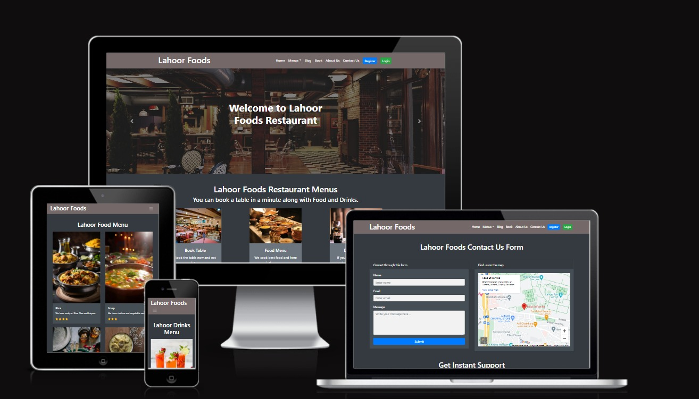

# Lahore Foods 

## Table of Contents
  - [About](#about)
  - [User Goals](#user-goals)
  - [Site Owner Goals](#site-owner-goals)
  - [User Experience](#user-experience)
  - [User Stories](#user-stories)
  - [Design](#design)
  - [Colours](#colours)
  - [Fonts](#fonts)
  - [Structure](#structure)
  - [Website pages](#website-pages)
  - [Database](#database)
  - [Technologies Used](#technologies-used)
  - [Features](#features) 
  - [Deploying to Heroku](#deploying-to-heroku)

### About

1. The Restaurant Booking System product is a fictional restaurant website. In addition to being able to browse pages such as the home page, menu, and contact page, users can also register an account, log in, utilize the table booking feature, and view bookings, which are not accessible to unregistered users. By using the booking and view booking navbar links, users can manage all their past bookings, including editing and deleting them. Site administrators have full access to all bookings and functionalities for creating, editing, and deleting. The website is designed to be fully responsive across desktop, laptop, tablet, and mobile devices.
2. This is Full-Stack application with good UX design principles which meets accessibility guidelines, it is easy to navigate and allows the user to find information, 

### User Goals

- Guest can Book the table.
- Guest can cancel the table and also edit & view the table.
- Guests are able to view our manu and contect information.

### Site Owner Goals

- Enhance user experience by offering an online table booking solution
- Increase clientele through a professionally designed website
- Develop a contemporary app with user-friendly navigation
- Ensure full responsiveness and accessibility for all users.

## User Experience

### Target Audience

- Customers interested in reserving a table for a meal or gathering with loved ones.
- Existing and potential clientele for the company.
- Travelers exploring the region who are seeking a dining experience, a beverage, or both.
- Fans visiting the area for a sports event or a music concert.
- Individuals working in the vicinity often indulge in dining and refreshments post their work hours.

### User Needs and Anticipations.
  
  - Fully responsive
  - Accessible
  - An inviting layout
  - Online networking
  - Contact details
  - Accessibility

## User Stories

### Users

- As a User, I am able to effortlessly navigate through the site, enabling me to access every feature with ease.
- The User has the ability to utilize a navigation bar, footer, and social icons in order to easily navigate through the website, access various menus, and connect with social media platforms.
- I, as the owner of the website, have the ability to create a "Contact Us" page in order for users to easily reach out to my business.
-  The user has the ability to access the business's opening hours and contact information in order to be informed about the operating hours and to easily reach out through email, phone, and social media platforms.
- The user has the ability to make a reservation by choosing a specific date and time, enabling them to secure a table.
- I, as a user, have the ability to modify my reservation in order to select a different time and date that is available.
- As a User, I have the ability to delete my booking in order to cancel my table reservation.
- As a user, I have the ability to access my booking details in order to conveniently recall the date and time of my reservation.
- Users have the ability to log in in order to reserve a table.
- As a User, I receive notifications to ensure that I am informed about the successful completion of my actions, such as creating, editing, or deleting a booking.
- As a User, I have the ability to access the food and drink menu in order to make a decision about dining at the restaurant.

### Admin 
- As an administrator, I have the ability to log in, in order to gain access to the website's backend.
- As an Administrator User, I have the ability to manually create a reservation, enabling me to secure a table in the event of a phone call or email from a customer requesting a booking
- As an administrator, I possess the ability to perform various operations on food and drink items within the database. This includes creating, reading, updating, and deleting these items. By utilizing these functionalities, we are able to add, remove, rename, and view all the food and drink items in our resturant menu.

### Site Owner
-  I, as the owner of the website, have the ability to offer a completely responsive site to my customers in order to ensure they receive a positive user experience.
-  As the owner of a website, I have the ability to verify the data that is entered into my site. This ensures that all submitted information is accurate and helps to prevent any potential errors.

### Kanban
- The GitHub Kanban board was utilized for monitoring all active user stories.
- The kanban board utilized the headings Backlog, In Progress, and Done.

## Design
### Colors
- I selected deep hues for the website, which gives it an appealing and contemporary look.
### Fonts
- The chosen fonts were sourced from Google Fonts.
### Structure
#### Website pages

 - The website was created with the intention of making the layout user-friendly, featuring a navigation bar at the top of each page and a hamburger menu button for smaller screens.
- The footer includes various social media links for users to easily access and follow the business on different platforms, ultimately increasing the business's online presence and engagement.
- 

The website comprises of the subsequent pages.

- The main page consists of various cards that allow users to select options such as reserving a table, browsing the food menu, or exploring the drinks menu.
- The food menu comprises the up-to-date compilation of all the food options that are currently available at the restaurant.
- The drinks menu displays the up-to-date selection of beverages offered at the restaurant.
- The blog page contains a paginated list of blogs that have been posted by an administrator or an authorized user.
- Registered users can utilize the book page to reserve a table, specify the number of guests, select the desired date and time, and indicate their preferred table location.
- The edit booking feature enables users to modify their reservation details, including the date, time, table, and number of guests.
- The cancellation of a booking enables the user to terminate their reservation.
- Users can utilize the Login/Logout feature to access their accounts, enabling them to make bookings as well as view, edit, and delete existing bookings.

#### Database
- The Heroku version is deployed with a Postgres database, using Python and the Django framework for its development.
## Technologies Used

### Languages & Frameworks

- HTML
- CSS
- Javascript
- Python
- Django

### Libraries & Tools
- Am I Responsive
- GitHub
- Google Fonts
- Heroku Platform
- jQuery
- Postgres
- pixabay free photos
- Bootstrap

## Features

- The homepage consists of a navigation bar, main content section, and a footer.
- Fully Responsive
- Indicates login/logout in status
- displayed on all pages
- Includes links to social media platforms and copyright information.
- displayed across all pages
- Users are able to create an account by providing a username and password.

### Login
- Customers have the ability to log in to their account in order to make a reservation, check existing bookings, as well as modify or remove bookings.

### Logout
- Enables the user to safely sign out.

### Book
- Enables users to reserve a table through the booking form.
- Upon booking a table, the customer will be able to view the confirmation message displayed at the top of the screen
### Edit Booking
- The user is able to modify their reservation for a different date, time, number of guests, and table.
- When the table booking is edited by the customer, they will be able to view the confirmation message displayed at the top
### Cancel Booking 
- The user is given the option to cancel their booking and is prompted to confirm their decision.
- Upon canceling the table booking, the customer will be able to view the confirmation message at the top of the screen and will be required to confirm the cancellation.

### Deploying to Heroku

It is strongly recommended to deploy a Django project early in order to address the complexities associated with the development process and the application itself.

1. This application has been deployed from Github using Heroku.
2. Develop an application and assign it a name like lahore food, then proceed to choose a specific region.
3. Go to the Settings tab and uncover the configuration variables. Include a key named DISABLE_COLLECTSTATIC with a value of 1, then click on the Add button.
4. Please ensure that your code is updated for deployment and set up a production-ready web server for Heroku.
5. Establish a file titled Procfile within the main directory of the project. 
6. Within the Procfile, specify that this is a web process and provide the command to run your Django project.
  (web: gunicorn my_project.wsgi)
7. Make sure to configure the connection to the Heroku Postgres database in the settings.py file, without any indentation if a separate test database is not being used. I personally keep mine stored in env.py
8. In the settings.py file, I included the Heroku name along with herokuapp.com in the ALLOWED_HOSTS variable. Additionally, I appended a comma and 'localhost' to allow the application to run in the development environment.
9. Install gunicorn and include it in the requirements.txt file by executing the command pip3 freeze > requirements.txt.
10.  Upon completion of constructing my application, I proceeded with the initial stage of the final deployment by changing the Debug setting to False in the settings.py file within Gitpod.
11. In Heroku I removed the DISABLE_COLLECTSTATIC variable.
12. Within the Deployment section on Heroku's platform, I selected Github as the Deployment method, enabled Automated Deployment, located my Github repository, linked it to my Heroku application, and initiated the deployment process by clicking on Deploy Branch located at the bottom of the page.
13. I have successfully saved my modifications on all of my files and executed the commands git add, git commit, and git push.
14. After enabling automatic deployment in Heroku, I patiently awaited the completion of my app's construction. Once it was ready, I accessed it and meticulously verified the smooth functioning of all its features.

## Credits
### Images
- The images utilized were obtained from the website pixabay free photos.com.
### Code
- The Bootstrap dark navigation theme was implemented in conjunction with Bootstrap classes and a carousel.

## Acknowledgements
#### I would like to express my gratitude to the individuals listed below.
- I am grateful to my mentor Mo Shami for providing feedback, advice, guidance, and support.
- I am grateful to my friend for his assistance, guidance, testing help. 
- To the wonderful individuals within the Code Institute and Slack community.